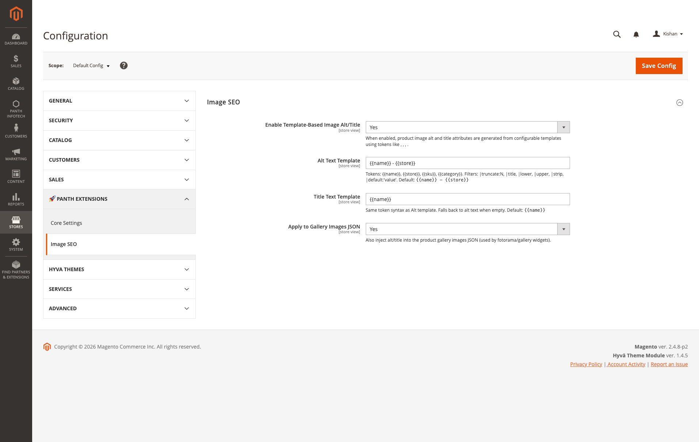

<!-- SEO Meta -->
<!--
  Title: Magento 2 Image SEO Extension: Auto Alt Text and Title for Product Images | Hyva + Luma | Panth Infotech
  Description: Panth Image SEO auto-generates SEO-optimized alt and title attributes for every product image in Magento 2 from configurable templates. Tokens for name, SKU, store, category. Filters for truncate, title-case, strip, default. Works across category grids, product galleries, widgets, cross-sells. Compatible with Magento 2.4.4 to 2.4.8, PHP 8.1 to 8.4, Hyva and Luma themes.
  Keywords: magento 2 image seo, magento 2 image alt text, magento 2 alt attribute, magento 2 image title, magento 2 product image seo, magento 2 seo extension, magento 2 image optimization, hyva image seo, luma image seo, magento 2 bulk alt text, magento 2 auto alt text, magento 2 image alt generator
  Author: Kishan Savaliya (Panth Infotech)
  Canonical: https://kishansavaliya.com/magento-2-image-seo.html
-->

# Magento 2 Image SEO Extension: Auto Alt Text and Title for Product Images (Hyva + Luma)

[](https://magento.com)
[](https://php.net)
[](https://www.hyva.io)
[](https://kishansavaliya.com/magento-2-image-seo.html)
[](https://packagist.org/packages/mage2kishan/module-image-seo)
[](https://www.upwork.com/freelancers/~016dd1767321100e21)
[](https://kishansavaliya.com)

> **Auto-generate SEO alt and title attributes for every product image across your entire Magento 2 catalog.** One template, configurable per store view, applied to category grids, product galleries, related products, upsells, cross-sells, widgets, and search results.

**Product page:** [kishansavaliya.com/magento-2-image-seo.html](https://kishansavaliya.com/magento-2-image-seo.html)

---

## Quick Answer

**What is Panth Image SEO?** It is a Magento 2 image SEO extension that auto-generates alt and title attributes for every product image from merchant-controlled templates with tokens like `{{name}}`, `{{sku}}`, `{{store}}`, and `{{category}}`.

**What does it add to my store?**

- **Template-based alt text** so every product image gets a descriptive, keyword-rich alt attribute instead of a blank or generic one.
- **Template-based title text** with a separate template so you can keep titles short while alt attributes carry full SEO copy.
- **Token and filter system** including truncate, title-case, upper, lower, strip, and default fallback.
- **Store view scope** so each language or brand store view can have its own alt text templates.
- **Gallery injection** to push alt/title into the product gallery JSON used by fotorama and Hyva gallery widgets.

**Which themes are supported?** Both **Hyva** (Alpine.js) and **Luma**. The module hooks into Magento's standard image rendering paths so it works on both without theme-specific code.

**What does it need?** Magento 2.4.4 to 2.4.8, PHP 8.1 to 8.4, and the free `mage2kishan/module-core` package.

---

## Need Custom Magento 2 Development?

> **Get a free quote for your project in 24 hours** for custom modules, Hyva themes, performance work, M1 to M2 migrations, and Adobe Commerce Cloud.

<p align="center">
  <a href="https://kishansavaliya.com/get-quote">
    
  </a>
</p>

<table>
<tr>
<td width="50%" align="center">

### Kishan Savaliya
**Top Rated Plus on Upwork**

[](https://www.upwork.com/freelancers/~016dd1767321100e21)

100% Job Success • 10+ Years Magento Experience
Adobe Certified • Hyva Specialist

</td>
<td width="50%" align="center">

### Panth Infotech Agency
**Magento Development Team**

[](https://www.upwork.com/agencies/1881421506131960778/)

Custom Modules • Theme Design • Migrations
Performance • SEO • Adobe Commerce Cloud

</td>
</tr>
</table>

**Visit our website:** [kishansavaliya.com](https://kishansavaliya.com) &nbsp;|&nbsp; **Get a quote:** [kishansavaliya.com/get-quote](https://kishansavaliya.com/get-quote)

---

## Table of Contents

- [Who Is It For](#who-is-it-for)
- [Key Features](#key-features)
- [Compatibility](#compatibility)
- [Installation](#installation)
- [Configuration](#configuration)
- [How It Works](#how-it-works)
- [Token Reference](#token-reference)
- [Filter Reference](#filter-reference)
- [Template Examples](#template-examples)
- [Coverage - Where Alt/Title Gets Injected](#coverage---where-alttitle-gets-injected)
- [Screenshots](#screenshots)
- [FAQ](#faq)
- [Support](#support)
- [About Panth Infotech](#about-panth-infotech)
- [Quick Links](#quick-links)

---

## Who Is It For

- **Stores with large catalogs** where writing alt text manually for hundreds or thousands of product images is not practical.
- **Merchants focused on image search traffic** who want product photos to appear in Google Images with proper alt attributes.
- **Hyva storefronts** that need gallery alt/title injected into the Alpine.js gallery JSON without custom theme code.
- **Multi-store and multi-language setups** where each store view needs different alt text copy or a different brand suffix.
- **Merchants facing accessibility audits** where blank or generic alt attributes on product images are flagged.

---

## Key Features

### Template-Based Alt and Title Generation

- **Tokens** - `{{name}}`, `{{sku}}`, `{{store}}`, `{{category}}` rendered per image in real time.
- **Filters** - chain `|truncate:N`, `|title`, `|lower`, `|upper`, `|strip`, `|default:'value'` inside any token.
- **Separate templates** - configure alt text and title text independently.
- **Graceful fallbacks** - empty templates fall back to product name so no image ever renders with a blank alt attribute.

### Store View Aware

- **Scope-respecting** - every setting is configurable at default, website, or store view level.
- **Multi-language stores** - different alt text per store view for localized storefronts.
- **Multi-brand stores** - different brand name in the alt text per website.

### Complete Surface Coverage

- **Product detail page** - main gallery image alt and title.
- **Product gallery** - fotorama and Hyva gallery captions with multi-image position suffix.
- **Category grid tiles** - alt text on every product card in category listings.
- **Related, upsell, and cross-sell widgets** - template applied to every widget image.
- **Search results** - alt text on search result product thumbnails.
- **CMS product widgets** - alt text on featured-product and new-arrival widgets.

### Safe Merchant Overrides

- **Preserves merchant-authored labels** - if a product has a custom image label set in admin, that label takes precedence.
- **Replaces Magento defaults** - the generic `Image`, `main product photo`, or filename placeholders get upgraded automatically.
- **One config toggle** - disable gallery injection separately if you only want alt text on tiles, not captions.

### Performance Conscious

- **Runs inline** - no external API calls, no DB writes, pure template rendering.
- **Scope-cached config reads** - uses Magento's cached scope config, zero DB overhead after warm-up.
- **Zero JavaScript** - fully server-side, no client-side rendering overhead.

### Clean and Extensible

- **MEQP compliant** - follows Adobe's Magento Extension Quality Program standards.
- **Pluggable vision adapter** - `VisionAdapterInterface` lets you swap in an AI vision provider for AI-generated fallback alt text.
- **Optional Panth_ProductGallery wire** - integrates automatically when the gallery module is installed.
- **Well-scoped plugins** - four targeted plugins (ImageFactory, Helper\Image, Gallery, Uploader) rather than sweeping preferences.

---

## Compatibility

| Requirement | Versions Supported |
|---|---|
| Magento Open Source | 2.4.4, 2.4.5, 2.4.6, 2.4.7, 2.4.8 |
| Adobe Commerce | 2.4.4, 2.4.5, 2.4.6, 2.4.7, 2.4.8 |
| Adobe Commerce Cloud | 2.4.4 to 2.4.8 |
| PHP | 8.1.x, 8.2.x, 8.3.x, 8.4.x |
| Hyva Theme | 1.0+ (native support) |
| Luma Theme | Native support |
| Required Dependency | `mage2kishan/module-core` (free) |
| Suggested Integration | `mage2kishan/module-productgallery` (auto-wires into the custom gallery) |

---

## Installation

### Composer Installation (Recommended)

```bash
composer require mage2kishan/module-image-seo
bin/magento module:enable Panth_Core Panth_ImageSeo
bin/magento setup:upgrade
bin/magento setup:di:compile
bin/magento setup:static-content:deploy -f
bin/magento cache:flush
```

### Manual Installation via ZIP

1. Download the latest release from [Packagist](https://packagist.org/packages/mage2kishan/module-image-seo) or from the [product page](https://kishansavaliya.com/magento-2-image-seo.html).
2. Extract it to `app/code/Panth/ImageSeo/` in your Magento install.
3. Make sure `Panth_Core` is installed too (required dependency).
4. Run the commands above starting from `bin/magento module:enable`.

### Verify Installation

```bash
bin/magento module:status Panth_ImageSeo
# Expected: Module is enabled
```

After install, open:
```
Admin → Stores → Configuration → Panth Extensions → Image SEO
```

---

## Configuration

Go to **Stores → Configuration → Panth Extensions → Image SEO**.

| Setting | Group | Default | Description |
|---|---|---|---|
| Enable Template-Based Image Alt/Title | Image SEO | Yes | Master toggle. When No, all plugins become no-ops and Magento's native behavior is used. |
| Alt Text Template | Image SEO | `{{name}} - {{store}}` | Template rendered into every `` attribute. Supports tokens and filters. |
| Title Text Template | Image SEO | `{{name}}` | Template rendered into every `` attribute. Falls back to alt text when empty. |
| Apply to Gallery Images JSON | Image SEO | Yes | Also inject alt/title into the product gallery images JSON used by fotorama and Hyva gallery widgets. |

All four settings are scope-aware (default / website / store view). Configure a different alt template per store view, a shorter title on a mobile-focused store, or localized copy for each language store.

---

## How It Works

1. The module installs four targeted plugins on Magento's image rendering paths.
2. When a product image is rendered, the active plugin checks the master toggle and reads the configured alt/title templates from scope config.
3. Tokens in the template are resolved: `{{name}}` becomes the product name, `{{sku}}` becomes the SKU, `{{store}}` becomes the current store view name, `{{category}}` becomes the current category name when available.
4. Filters are applied left to right: `{{name|lower|title|truncate:60}}` clips the title-cased product name at 60 characters.
5. If a product already has a custom merchant-authored image label, that label is kept as-is. Only Magento's default placeholder values are replaced.
6. The rendered alt and title text is injected into the image tag or gallery JSON before the response is sent to the browser.

---

## Token Reference

Every token is written as `{{tokenName}}` and can be combined with filters using `|filterName:arg`.

| Token | Value | Example Output |
|---|---|---|
| `{{name}}` | Product name | `Push It Messenger Bag` |
| `{{sku}}` | Product SKU | `24-WB04` |
| `{{store}}` | Current store view name | `Luma Store View`, `English`, `Wholesale` |
| `{{category}}` | Current category name (when resolvable) | `Bags`, `Women's Tops` |

Unknown tokens render as empty strings and trailing separators are auto-cleaned, so a template like `{{name}} - {{category}}` safely degrades to `Push It Messenger Bag` when category context is not available.

---

## Filter Reference

Filters are chained with `|` and run left to right.

| Filter | Syntax | Effect | Example |
|---|---|---|---|
| `truncate` | `\|truncate:N` | Clip to N characters and append `...` | `{{name\|truncate:20}}` |
| `title` | `\|title` | Title-case (first letter of each word uppercase) | `{{name\|lower\|title}}` |
| `upper` | `\|upper` | UPPERCASE the value | `{{sku\|upper}}` |
| `lower` | `\|lower` | lowercase the value | `{{name\|lower}}` |
| `strip` | `\|strip` | Remove HTML tags and collapse whitespace | `{{name\|strip}}` |
| `default` | `\|default:'Fallback'` | Use the argument when the value is empty | `{{category\|default:'Catalog'}}` |

Filters can be chained: `{{name|lower|title|truncate:40}}` is valid.

---

## Template Examples

### Basic name and store view

```
Alt:   {{name}} - {{store}}
Title: {{name}}
```

Renders as: `Push It Messenger Bag - Luma Store View`

### With truncation for long product names

```
Alt:   {{name|truncate:80}} | Buy Online at {{store}}
Title: {{name}}
```

### Category-scoped alt

```
Alt:   {{name}} in {{category|default:'our catalog'}}
Title: {{name}}
```

### SKU-prefixed alt for B2B catalogs

```
Alt:   [{{sku|upper}}] {{name}} | {{store}}
Title: {{name|truncate:60}}
```

### Minimal SEO-only

```
Alt:   {{name}}
Title: {{name}}
```

### Multi-store with localized copy

Configure **Alt Text Template** at the store-view scope:
- **English store view**: `{{name}} | Premium Quality from {{store}}`
- **French store view**: `{{name}} | Qualite Premium - {{store}}`
- **Wholesale store view**: `[WHOLESALE] {{name}} - {{store}}`

---

## Coverage - Where Alt/Title Gets Injected

The module hooks every surface where Magento renders a product image tag:

| Surface | Plugin | What gets injected |
|---|---|---|
| **Category page tiles** | `ImageFactoryPlugin` | `` on every product card |
| **Related / Upsell / Cross-sell** | `ImageFactoryPlugin` | Widget product image alt |
| **Search results grid** | `ImageFactoryPlugin` | Thumbnail alt on every result |
| **Product gallery (main image)** | `GalleryImageSeoPlugin` | `caption` field in gallery JSON |
| **Product gallery (thumbnails)** | `GalleryImageSeoPlugin` | `caption` + position suffix |
| **Product page label** | `ImageAttributesPlugin` + `ProductImagePlugin` | Helper-level `getLabel()` return value |
| **Admin image uploader** | `UploaderPlugin` | Default label on newly uploaded images |
| **CMS widgets** | `ImageFactoryPlugin` | Widget image alt |
| **Panth_ProductGallery** | Soft DI wire | When installed, injects `ImageTemplateResolver` into the custom gallery |

---

## Screenshots

### Admin Configuration - Stores → Configuration → Panth Extensions → Image SEO



*The admin UI exposes every setting at store-view scope: master toggle, alt template, title template, and gallery-injection toggle. Token and filter reference is inlined under each field.*

### Before / After - What Changes on Your Storefront

<p align="center">
  
</p>

*Before: `` or `` - invisible to image search, fails accessibility audits. After: `` - indexed, accessible, on-brand across every store view.*

---

## FAQ

### Does this work on Hyva themes?

Yes. The module injects into `getGalleryImagesJson`, which Hyva reads for its Alpine.js gallery. Category tile alt attributes go through `ImageFactory`, which Hyva's `product/list.phtml` also uses. No jQuery or RequireJS needed.

### Does it work with Luma?

Yes. Luma's fotorama gallery reads from the same `caption` field in the gallery JSON, and Luma's category grid uses the same `ImageFactory` path.

### Will it overwrite my custom image labels?

No. If a product has a custom image label set in admin (anything other than empty, `Image`, `main product photo`, or the raw filename), that label is preserved. Only Magento's default placeholder values are replaced.

### Will it slow down my storefront?

No. The module runs inline with no external API calls, no database writes, and no JavaScript. Config reads go through Magento's cached scope config so there is no extra DB overhead after warm-up.

### Can I use different alt text on different store views?

Yes. All four settings respect Magento's standard scope hierarchy (default, website, store view). Set a different template at the store-view scope and the plugins honor it automatically.

### Can I disable only the gallery injection?

Yes. Set **Apply to Gallery Images JSON** to No. The master toggle stays on so category tiles and widgets still get template alt, but the gallery JSON is left untouched.

### Is it compatible with Varnish and Redis FPC?

Yes. The module does not cache anything itself. It relies on Magento's native block cache and FPC. Template rendering is idempotent so cache hit rate is unaffected.

### Does it touch the database?

No. The module is pure template rendering with no DB tables and no writes. All state lives in Magento's cached scope config.

### Does Panth Image SEO need Panth Core?

Yes. `mage2kishan/module-core` is a required dependency. Composer installs it automatically. It provides the admin tab layout and common utilities used across the extension suite.

---

## Support

| Channel | Contact |
|---|---|
| Product Page | [kishansavaliya.com/magento-2-image-seo.html](https://kishansavaliya.com/magento-2-image-seo.html) |
| Email | kishansavaliyakb@gmail.com |
| Website | [kishansavaliya.com](https://kishansavaliya.com) |
| WhatsApp | +91 84012 70422 |
| GitHub Issues | [github.com/mage2sk/module-image-seo/issues](https://github.com/mage2sk/module-image-seo/issues) |
| Upwork (Top Rated Plus) | [Hire Kishan Savaliya](https://www.upwork.com/freelancers/~016dd1767321100e21) |
| Upwork Agency | [Panth Infotech](https://www.upwork.com/agencies/1881421506131960778/) |

Response time: 1-2 business days.

### Need Custom Magento Development?

Looking for **custom Magento module development**, **Hyva theme work**, **store migrations**, or **performance tuning**? Get a free quote in 24 hours:

<p align="center">
  <a href="https://kishansavaliya.com/get-quote">
    
  </a>
</p>

<p align="center">
  <a href="https://www.upwork.com/freelancers/~016dd1767321100e21">
    
  </a>
  &nbsp;&nbsp;
  <a href="https://www.upwork.com/agencies/1881421506131960778/">
    
  </a>
  &nbsp;&nbsp;
  <a href="https://kishansavaliya.com/magento-2-image-seo.html">
    
  </a>
</p>

---

## About Panth Infotech

Built and maintained by **Kishan Savaliya** ([kishansavaliya.com](https://kishansavaliya.com)), a **Top Rated Plus** Magento developer on Upwork with 10+ years of eCommerce experience.

**Panth Infotech** is a Magento 2 development agency that builds high quality, security focused extensions and themes for both Hyva and Luma storefronts. The extension suite covers SEO, performance, checkout, product presentation, customer engagement, and store management, with each module built to MEQP standards and tested across Magento 2.4.4 to 2.4.8.

Browse the full extension catalog on our [Magento extensions page](https://kishansavaliya.com/magento-extensions.html) or on [Packagist](https://packagist.org/packages/mage2kishan/).

---

## Quick Links

| Resource | Link |
|---|---|
| **Product Page** | [magento-2-image-seo.html](https://kishansavaliya.com/magento-2-image-seo.html) |
| **Packagist** | [mage2kishan/module-image-seo](https://packagist.org/packages/mage2kishan/module-image-seo) |
| **GitHub** | [mage2sk/module-image-seo](https://github.com/mage2sk/module-image-seo) |
| **Website** | [kishansavaliya.com](https://kishansavaliya.com) |
| **Free Quote** | [kishansavaliya.com/get-quote](https://kishansavaliya.com/get-quote) |
| **Upwork (Top Rated Plus)** | [Hire Kishan Savaliya](https://www.upwork.com/freelancers/~016dd1767321100e21) |
| **Upwork Agency** | [Panth Infotech](https://www.upwork.com/agencies/1881421506131960778/) |
| **Email** | kishansavaliyakb@gmail.com |
| **WhatsApp** | +91 84012 70422 |

---

<p align="center">
  <strong>Ready to fix your image SEO across the entire catalog?</strong><br/>
  <a href="https://kishansavaliya.com/magento-2-image-seo.html">
    
  </a>
</p>

---

**SEO Keywords:** magento 2 image seo, magento 2 image alt text, magento 2 alt attribute, magento 2 image title, magento 2 product image seo, magento 2 seo extension, magento 2 image optimization, magento 2 auto alt text, magento 2 bulk alt text, magento 2 image alt generator, magento 2 seo alt tags, magento 2 category image seo, magento 2 gallery alt text, magento 2 widget image alt, magento 2 wcag compliance, magento 2 accessibility alt, hyva image seo, hyva alt text, hyva image optimization, luma image seo, luma alt text, magento 2 image search seo, magento 2 google images, magento 2 multi-store alt text, magento 2 localized alt text, magento 2 alt template, magento 2 alt tokens, magento 2 image label extension, mage2kishan image seo, panth infotech image seo, kishan savaliya magento, magento 2.4.8 image seo, magento 2 php 8.4 image seo, hire magento developer upwork, top rated plus magento freelancer, custom magento development, adobe commerce image seo, magento 2 alt automation, magento 2 bulk image optimization
