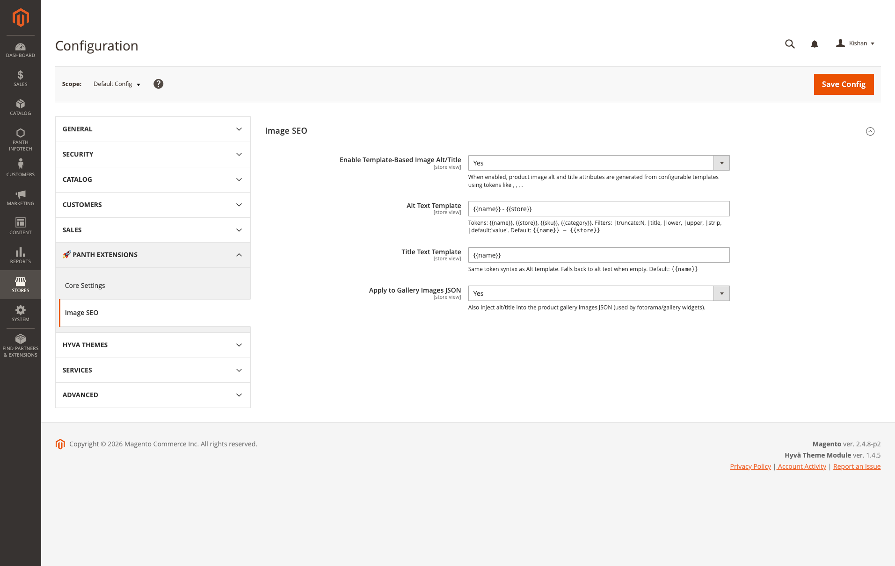

# Magento 2 Image SEO

Generates the `alt` and `title` attributes of product images from templates such as `{{name}} - {{store}}`, so every product image on the storefront carries descriptive text without editing each image label by hand. It also cleans the filenames of images uploaded through Magento's catalog image uploader.

The module is for store owners who want consistent image alt text for search engines and accessibility across category listings, product pages, widgets and the product gallery. Works with the Hyva and Luma themes.

Product page: [kishansavaliya.com/magento-2-image-seo.html](https://kishansavaliya.com/magento-2-image-seo.html)

## Features

- Alt and title templates with the tokens `{{name}}`, `{{sku}}`, `{{store}}` and `{{category}}`.
- Filters that can be chained on any token: `truncate:N`, `title`, `upper`, `lower`, `strip` and `default:'text'`.
- Applies to product images rendered through Magento's image blocks and image helper (category listings, search results, related and upsell lists, widgets, product page) and to the product gallery JSON used by the gallery widget.
- In the gallery, captions that were typed by a merchant are kept; empty captions, captions equal to the product name and Magento's placeholder labels are replaced, with "Image N of M" appended when a product has several images.
- Renames images uploaded through Magento's catalog image uploader to a lowercase ASCII filename (transliterated, hyphen separated, at most 120 characters).
- Settings per default, website or store view, so each store view can have its own template and language.
- Output is capped at 250 characters and stray separators from empty tokens are removed.
- No database tables, no cron jobs and no console commands.

## Compatibility

| | |
|---|---|
| Magento Open Source / Adobe Commerce | 2.4.4 to 2.4.8 |
| PHP | 8.1, 8.2, 8.3, 8.4 |
| Themes | Hyva and Luma |

The Composer package requires `magento/framework ^103.0`, `magento/module-store ^101.1`, `magento/module-catalog ^104.0` and `magento/module-config ^101.2`.

## Requirements

- Magento 2.4.4 or later
- PHP 8.1 to 8.4
- `mage2kishan/module-core` (installed automatically by Composer; provides the shared "Panth Extensions" admin tab)
- Optional: `mage2kishan/module-productgallery`. When it is installed, its gallery uses the same templates.

## Installation

```bash
composer require mage2kishan/module-image-seo
bin/magento module:enable Panth_Core Panth_ImageSeo
bin/magento setup:upgrade
bin/magento setup:di:compile
bin/magento cache:flush
```

`setup:di:compile` is only needed in production mode. The module has no static assets.

Check the result with:

```bash
bin/magento module:status Panth_ImageSeo
```

The module is enabled by default with the templates shown below, so product images get the generated text as soon as the cache is flushed.

## Configuration

Go to **Stores > Configuration > Panth Extensions > Image SEO**.

| Setting | Default | What it does |
|---|---|---|
| Enable Template-Based Image Alt/Title | Yes | Master switch for all plugins. |
| Alt Text Template | `{{name}} - {{store}}` | Template for the `alt` attribute. |
| Title Text Template | `{{name}}` | Template for the `title` attribute. When empty, the alt text is used. |
| Apply to Gallery Images JSON | Yes | Also writes the generated text into the product gallery JSON. |

Configuration paths: `panth_image_seo/image/image_seo_enabled`, `panth_image_seo/image/alt_template`, `panth_image_seo/image/title_template`, `panth_image_seo/image/gallery_seo_enabled`.



### Tokens

| Token | Value |
|---|---|
| `{{name}}` | Product name |
| `{{sku}}` | Product SKU |
| `{{store}}` | Name of the current store view |
| `{{category}}` | Name of the product's current category, when Magento has one in context (for example on a category page); empty otherwise |

Unknown tokens render as an empty string, and separators left behind by empty tokens (`-`, `|`, commas) are cleaned up, so `{{name}} - {{category}}` renders as just the product name when there is no category.

### Filters

Filters are appended to a token with `|` and run from left to right, for example `{{name|lower|title|truncate:40}}`.

| Filter | Effect |
|---|---|
| `truncate:N` | Cuts the value to N characters and appends `...` (N defaults to 60 when omitted). |
| `title` | Title case. |
| `upper` | Upper case. |
| `lower` | Lower case. |
| `strip` | Removes HTML tags and collapses whitespace. |
| `default:'text'` | Uses `text` when the value is empty. |

### Template examples

```
Alt:   {{name}} - {{store}}
Title: {{name}}
```

```
Alt:   {{name|truncate:80}} | {{store}}
Title: {{name}}
```

```
Alt:   {{name}} in {{category|default:'our catalogue'}}
Title: {{name}}
```

```
Alt:   [{{sku|upper}}] {{name}} | {{store}}
Title: {{name|truncate:60}}
```

For a multilingual store, set a different Alt Text Template on each store view.

## Usage

Once enabled, no further action is needed. Where the text is applied:

| Surface | How |
|---|---|
| Category listings, search results, related and upsell lists, widgets | Plugin on `Magento\Catalog\Block\Product\ImageFactory` sets the image label to the generated alt text. |
| Images rendered through `Magento\Catalog\Helper\Image` | Plugins on `getLabel()` return the generated alt text, or the product name when no template output is available. |
| Product gallery JSON (`Magento\Catalog\Block\Product\View\Gallery`) | Caption and title are replaced when the existing value is empty, equals the product name or is a placeholder ("Image", "Main product photo"). Merchant-written captions are kept. "Image N of M" is appended when there is more than one image. |
| Catalog image uploads (`Magento\Catalog\Model\ImageUploader`) | The stored filename is normalised to a clean ASCII slug. Existing files are not renamed. |

Note: on listing and helper-rendered images the generated text replaces whatever label the image had. If you rely on hand-written labels there, keep the module switched off for that store view or make the template reproduce them.

Rendering happens on every request from the templates in configuration; nothing is written to product data, so changing a template takes effect after a cache flush.

## Developer Notes

- Module name: `Panth_ImageSeo`
- Composer package: `mage2kishan/module-image-seo`
- PHP namespace: `Panth\ImageSeo`
- Template engine: `Panth\ImageSeo\Model\ImageSeo\AltGenerator`; resolver with the configured templates: `Panth\ImageSeo\Model\ImageSeo\ImageTemplateResolver` (`getAlt()`, `getTitle()`, `resolve()`).
- Extension point: `Panth\ImageSeo\Model\ImageSeo\VisionAdapterInterface`. The default `NullVisionAdapter` does nothing; a custom adapter can be bound through a DI preference to supply generated descriptions when the generator is called with an image path. No image analysis is performed by default.
- Upgrade from Panth Advanced SEO: the data patch `MigrateConfigPaths` moves saved values from `panth_seo/image/*` to `panth_image_seo/image/*` during `setup:upgrade`. When a value already exists under the new path for the same scope, the existing value is kept and the legacy row is left in place.
- ACL resource for the configuration section: `Panth_ImageSeo::config`

## Uninstallation

```bash
bin/magento module:disable Panth_ImageSeo
composer remove mage2kishan/module-image-seo
bin/magento setup:upgrade
bin/magento setup:di:compile
bin/magento cache:flush
```

The module creates no database tables and does not modify product data. Configuration values remain in `core_config_data` until removed. Filenames that were normalised at upload time are not changed back.

## Support

- Product page: [kishansavaliya.com/magento-2-image-seo.html](https://kishansavaliya.com/magento-2-image-seo.html)
- Contact: [kishansavaliya.com/contact](https://kishansavaliya.com/contact)
- Email: kishansavaliyakb@gmail.com
- Bug reports: [GitHub issues](https://github.com/mage2sk/module-image-seo/issues)

## License

Proprietary, as declared in `composer.json`. The package is published on Packagist and can be installed with Composer; see the product page for the terms of use.

## Changelog

See [CHANGELOG.md](CHANGELOG.md).

## Links

- Website: [kishansavaliya.com](https://kishansavaliya.com)
- All extensions: [kishansavaliya.com/magento-extensions.html](https://kishansavaliya.com/magento-extensions.html)
- GitHub: [mage2sk/module-image-seo](https://github.com/mage2sk/module-image-seo)
- Packagist: [mage2kishan/module-image-seo](https://packagist.org/packages/mage2kishan/module-image-seo)
